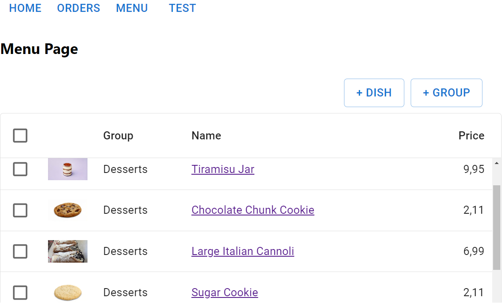
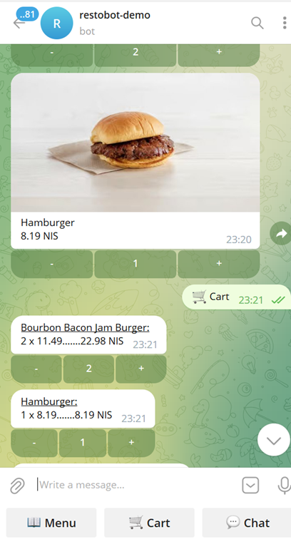
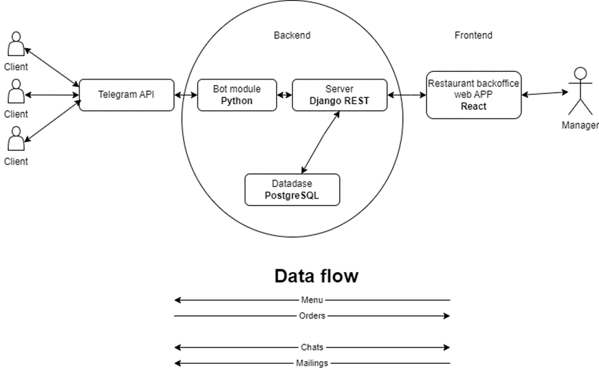

**Restobot** is my learning project in the Tel-Aviv Developers Institute.

The project aims to facilitate communication between restaurants and their clients using a Telegram bot.

On the restaurant side, there is a web application that allows menu editing, real-time order management, client communication, and the option to send mailings to all clients.

The clients can access the restaurant's menu, place orders, and inquire about dishes directly through the chatbot.

**Stack:**
* Database: PostgreSQL
* Backend: Django Rest, Python
* Bot Module: Aiogram, Python
* Frontend for restaurants: React, JavaScript, Material UI

**Deployment:**
* Database: Render
* Static and Media Files: Amazon S3
* Backend: Heroku

**Data scheme:**

**Features:**

For Managers in the Web App:
* Edit the menu by adding, editing, or deleting dishes, and create categories.
* Add dishes to the stop-list (temporarily remove them from the menu).
* Receive and approve incoming orders.
* Send messages directly to individual clients.
* Send mass mailings to all clients.

For Telegram users:
* Access the restaurant's menu, view pictures, descriptions, and prices of dishes.
* Explore different categories within the menu.
* Search for specific dishes by name.
* Add dishes to the cart.
* Calculate the total price of the order.
* Provide necessary details and submit the order.
* Engage in direct communication with the restaurant through messages.

**Links:**

* [The Bot](https://t.me/demo_restobot)

* [Admin page](https://restobot-admin-f22c572188ab.herokuapp.com/)

* [Video Presentation](https://restobot-img1.s3.eu-central-1.amazonaws.com/static/media/Restobot_presentation.mp4)

* [GitHub (Django Backend + Telegram module) 
](https://github.com/DmitryArtamonov/Restobot)

* [GitHub (React Frontend)](https://github.com/DmitryArtamonov/Restobot_admin
) 

* [My Portfolio](https://dmitryartamonov.github.io/Portfolio/
)

**Contacts**

* [Gmail: artamonov2009@gmail.com](mailto:artamonov2009@gmail.com
)
* [Telegram](https://t.me/dmitry_2727)
* [Gitgub](https://github.com/DmitryArtamonov)
* [LinkdIn](https://www.linkedin.com/in/dmitry-artamonov-660b16267/)